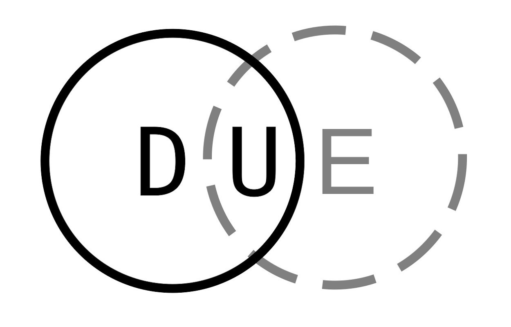

# Getting Started
  
Copyright 2022,2023 Nvidia Corporation.  All rights reserved.

**Formatting Conventions**  
If you are viewing this document as a text file, literal commands to type
are start and end with back ticks like `this`. If you are using a Markdown viewer, you will see just the text: this but the font will be `different`.  
**The point**  
If you cut and paste from this file, do not copy the `s

# Debian/Ubuntu based hosts
You have a few install options here:  

## Install a released version with APT
Newer versions of Debian and Ubuntu have upstreamed versions of DUE, so `sudo apt-get install due` may work for you.  

## Install a prebuilt release .deb file
.deb files associated with each release are available at DUE's GitHub page here:  
[https://github.com/CumulusNetworks/DUE/releases](https://github.com/CumulusNetworks/DUE/releases)  
Or you can build your own from source by creating a DUE container for your desired operating system and using it with `make debian-package`

Once you have the .deb file,  
1. Install the deb and expect dependency errors with: `sudo dpkg -i due_*all.deb`  
2. Use APT to resolve the dependency errors with: `sudo apt-get install --fix-broken`  
  
## Install from a Git checkout of the source code  
See **Installing from a Git checkout** below.

# Red Hat/SUSE based hosts
You have a few install options here
  
## Install a prebuilt release .rpm file
.rpm files associated with each release are available at DUE's GitHub page here:  
[https://github.com/CumulusNetworks/DUE/releases](https://github.com/CumulusNetworks/DUE/releases)    
Or you can build your own by creating a DUE container for your desired operating system and using it with `make rpm-package`  

Once you have the .rpm file, use your package manager to install it, and the dependencies that come with it. Depending on the operating system used, this may look like:  
  * `yum install due_*noarch.rpm` (older Fedora/Red Hat Enterprise Linux)   
  * `dnf install due_*noarch.rpm` (newer Fedora/Red Hat Enterprise Linux)  
  * `zypper install due_*noarch.rpm` (OpenSUSE/SLES)  
    
And, of course, there is always:  

# Installing from a Git checkout

## Install DUE's software dependencies
To run DUE from the source directory, you will need to install the following
packages:  
  *  One of: docker.io, docker.ce, or podman
  *  git  
  *  bsdutils  
  *  rsync  
  *  jq  
  *  curl  
  *  and maybe pandoc, if you plan on updating the man pages.

Running `make install` from the `master` Git branch as root will attempt to install these packages for both Debian and Red Hat Linux, as well as placing DUE's files in the appropriate directories on your host system.

## If you are using Docker, add yourself to the Docker group 
Podman (which is preferred on Red Hat/SUSE host systems) does not require a group membership for users to run containers, but Docker (preferred on Debian based systems) does. So if Docker is installed, make sure you add yourself to the docker group with:

`sudo /usr/sbin/usermod -a -G docker $(whoami)`

Even though running `groups` will show you as a member of the `docker` group, you will probably have to log out and back in for your new membership to take effect.

## Run DUE locally with ./due
If DUE is invoked with a ./, it will use the copy of `due` in the local directory (as expected) and use the template files that are under the local directory. This allows users to try it out without installing it on their systems.  
  
**Ex:** `./due`

**TIP**
When running locally, DUE will print the source locations of files pulled in from locations other than the system defaults. These are typically `libdue` and perhaps a user's `due.conf` if the sysadmin has set `DUE_ALLOW_USER_CONFIG="TRUE"` in the host system's  `/etc/due/due.conf`.  
So when running an image from a git checkout, with `due --run`, one could expect to
see something like this printed after the image to run has been selected.

`==== Sourcing DUE files from:     [ /home/adoyle/DUE ]`  
`====                     due:     [ ./due ]`  
`====                  libdue:     [ /home/adoyle/DUE/libdue ]`  
`==== Sourcing due.conf  from:     [ /home/adoyle/.config/due/due.conf ]`  

## Installing DUE
The preferred method of installing DUE is to build a .deb of it, using the debian/master branch and install the deb.    
Alternately, typing `make install` as `root` from the master Git branch will install DUE files in the system, which is currently the easiest way to install DUE in a Red Hat Linux system.

# A Practical Example: create an image and build DUE as a Debian package
DUE can be used to build itself as a Debian package.

1. Start with DUE's `master` Git branch.
2. Create a Debian package build container, using an example from `./due --create help`.  
   If you are using Ubuntu, this might look like:  
   `./due --create --from ubuntu:18.04 --description "Package Build for Ubuntu 18.04" --name pkg-u-18.04 --prompt PKGU1804 --tag pkg-ubuntu-18.04 --use-template debian-package`  
   **TIP** `--filter` term  can be used with `due --create --help` to limit the output to entries that match the term.  
3. At this point you can type `make debian-package`and the makefile will:  
3a. `make orig.tar`  
3b. `git checkout debian/master`  
3c. `due --build`  
3d. Ask you to choose the image to build with, if you have more than one.  
3e. Build the .deb, leaving it in the parent directory of DUE.  
3f. ...and check out the `master` Git branch again.  
...or you can run those steps individually.

Once the build completes, there should be a due*.deb in the directory above where you just built. This can be installed with:  
`sudo dpkg -i due_*all.deb`

**Note** if you have problems, read the `Troubleshooting.md` file which is in the current directory.

## Working in a container

1. Run `./due --run`
   If the image created in the previous step is the only one on the system, it will be run by default. Otherwise DUE will present a menu of images to choose from.  
Example:  

    `  REPOSITORY                      TAG                   SIZE                IMAGE ID`  
    `-----------------------------------------------------------------------------------------`  
    `1  due-example-debian-10          debian-10             114MB               b45c5e64d1a3`  
    `2  due-package-debian-10          debian-10             732MB               6053b1f43bcd`  
    `3  due-onie-build                 debian-9              823MB               70cb5b66aa87`  
    `4  due-pkg-u-18.04                pkg-ubuntu-18.04      598MB               aae462a75630`  

2. For reference, the Docker command used to start the container will scroll by, as well as the output
from the DUE scripts that dynamically create your user account in the container, and any other additional
configuration.  
3. DUE will have mounted your home directory by default and created a user account for you in the container that matches the one you have on your host system.  
4. You are now in a bash shell in the container. DUE defaults to setting the prompt to something that indicates
the role of the container, as this may not be obvious. The Ubuntu package build example sets the prompt to `<username>@PKGU1804`
5. If you want to use the default build script for the container, run `duebuild --help` to see what common build operations are available, or just start to build as you normally would.
6. Type `exit` to leave the container.

..And that's the basics of using DUE to create and run containers.

 
**TIP** You can specify the image to use with `--run-image`:  
**Ex:** `due --run-image due-pkg-u-18.04:pkg-ubuntu-18.04 --build` <- build using `due-pkg-u-18.04` image with tag `pkg-ubuntu-18.04`  

The rest of this document will get in to using specific types of containers, and how you can create and debug your own.  
**TIP** Take a look at the README.md files under the `./templates` directory as well.

# Run time: A few things to know about running DUE

Take a look at the help by running `./due --run help`  
You'll find things like using `--image` (to limit the names of images shown, or run a particular container)
or using `--login` to access a running container

### Local or system context?
DUE can be built as a Debian package and be installed system-wide, or run from the local directory.  
There are a few behavior changes depending on which option you're using.

#### Local context
If you are using DUE from a source code check out, invoking it with `./due` limits its search
paths for templates and the `libdue` library to the local directory. This is useful for local
debugging, or trying it out without having to install it.

#### System context
If you build DUE into a package and install it, it will store the templates under `/usr/share/due`.
The templates that are available system-wide can be listed with `due --create help`

DUE also installs an `/etc/due/due.conf` that will hold any system wide settings.
Users can override this by running:
 `./due --manage --copy-config` 
which will install:
   ~/.conf/due/due.conf`

###Tip: Knowing you are in a Docker container
Docker containers have a `/.dockerenv` file, so any configuration scripts you
have can be set to check for that.

For example, on my laptop, DUE is configured to mount ~/
My .bashrc has the following logic:

>    `#Only set prompt if NOT in a container.`  
>    `if [ ! -e /.dockerenv ];then`  
>    `        export PS1='\u@\h$:\$ '`  
>    `fi`  

This allows me to preserve the prompt hints that describe the container.

# Files:
 **`due`**  
 User interface script for DUE, and the script that a user executes at run time.
 Note: If due is run with ./due, it references all the local files, rather than
 ones that may be installed on the system.

 **`libdue`**  
 Library functions that are the core code of DUE

 **`LICENSE.txt`**  
 Documents DUE's MIT license

 **`README.md`**  
 Starter documentation.   

 **`Makefile`**  
 This is present in the Master branch for basic installation and configuration. It is **not** present in the `debian/*` branches.  

 
### Directories:

 **`debian`**  
 Files for building DUE as a Debian package, rules, changelog, etc. Note: this is, for obvious reasons, only present in `debian/*` Git branches.

 **`docs`**  
 DUE documentation

 **`etc`**  
 Holds the DUE configuration file for the system's /etc directory. A copy of this is added to the user's home directory under:  
 `~/.config/due/due.conf`  
 Note that there are currently two configurable parameters for the system (`/etc/due/due.conf`) or a user (`~/.config/due/due.conf`)  
 `DUE_ENV_DEFAULT_HOMEDIR` - change your home directory to another directory on the host. Handy if your home directory is on an NFS file system (See `Troubleshooting.md`) or you need to use a different disk partition to work in.  
  `DUE_USER_CONTAINER_LIMIT` - set a limit on multi user systems for how many containers a user should be running. Sometimes it is tough to keep track...  
  
					
 **`templates`**  
 Holds all files used to create a dedicated type of image.
 The default is to use just the contents of `common-templates` if no other template type is specified.
 If a template type is specified (ONIE build, Debian package build, etc) then that will be merged
 with the contents of `common-templates` to produce the image.  
 Files ending in `.template` are processed to contain values set by using arguments in conjunction with
 `--create`, so that things like the source container, prompt, or name can be set dynamically.
 

 **`image-patches`**  
 Holds files that are added to image creation before the template files.  
 For example, there is a patch to the Debian 9 `/etc/apt/sources.list` file which updates
 the package repositories the container uses to reference repositories that have been moved for archiving.
 Since the Debian 9 image can be used by the `ONIE` and `debian-package` templates, this file needs to be in a location where it can be accessed by both.    
This these files are applied using --image-patch with the --create option. Run `due --create --help` to see an example.
 

 **`due-build-merge`**  
 This is the work/build area that holds image merges for build. For any image build, there will be two directories:
 
 1.  **`<name>-template-merge`** Directory generated by `--create` when a `--use-template `
   is specified. This directory contains the contents of `templates/common-templates`,
   with the contents of the specified source template (`debian-package`, `example`,etc)
   merged in.  
   If the source template has a file with the same name as a common template,
   the common template file will be overwritten.  
   At this stage, all the files are present, but strings in them that get replaced for
   final configuration have not been replaced yet.
					   
 2.  **`<name>`**      This is mostly a copy of `name-template-merge` but with all **REPLACE** terms in the files
 set to their final values. This would be things like the base docker image to use, the name of the image,
 or the prompt to use inside the container. The Dockerfile used to create the final image comes from this
 directory. By default, DUE runs the configuration and build
 as a single step. It's left broken out here as it is useful for debugging. Changes to configuration can be
 made in this directory and a new image generated by running `due --create --dir`. Of course, if you want
 those changes to be preserved for future creation, you'll need to update the `DUE/templates` directory with a new entry.

**TIP** the image build area can be deleted for a clean build by running `due --create --clean`

#Image build details:

If you want a closer look at how the templates get turned in to the final Dockerfile
We'll start with the files involved.

### Directory creation works as follows:

Establish the starting template directory.
If `--use-template` is not passed, `templates/common-templates` is used as the starting template directory

If `--use-template <role>` is used, the files from `templates/<role>` are merged with 
the files from common-templates into a `<name>-template-merge` directory, where
`<name>` was supplied on the command line by the --name argument.

**So:**  
`templates/<role> + common-templates = <name>-template-merge directory`

####Create the build directory

This copies any non-template files from the `<name>-template-merge` directory
into the `<name>` directory under `due-build-merge/`.
It then parses the *.template files that:  
1. Originated in the `<role>` template directory.  
2. Were copied into `<name>-template-merge` directory.  
3. Parses them and replaces terms defined with `REPLACE_` with values specified by the user. (Things like the prompt, or originating container)  
4. ...and copies them in the `<name>` directory.  

**So:**  
`<name>-template-merge directory + template REPLACE preprocessing -> build directory <name>`

Finally, the Docker image is created using `--create --dir <name>`, parsing the contents of `<name>`.

Due will run all of this in one step. Having both stages preserved can be handy for debugging,
which is why it's not just one directory, with term replacements done in place.

**So to summarize:**
`templates/<role> + common-templates + template REPLACE preprocessing =  build directory <name> -> build image`

###Example: image creation.

Create a build directory for ONIE, and build the image:  
`./due --create --from debian:stretch --description \"ONIE build container\" --name oniebuild --prompt ONIE --tag onie-build --use-template onie"`  
  

This creates:  
  * the starting template directory onie-template-merge from `templates/onie`  
  * the configuration directory oniebuild-build-merge  
  * the build directory oniebuild  
  * and builds the image  

###Example: image re-creation
To modify and rebuild an image, you'll want to wipe out the intermediate directories that were created by the last build of the image. You can manually delete the `<name>` related directories in `due-build-merge`, or run:  
 `./due --create --clean`    
to have the directories deleted.

You can build just the Docker image stage with `./due --build-dir <path to name>`
##Example: build the Docker image from an existing directory.
	`./due --create --build-dir oniebuild`

